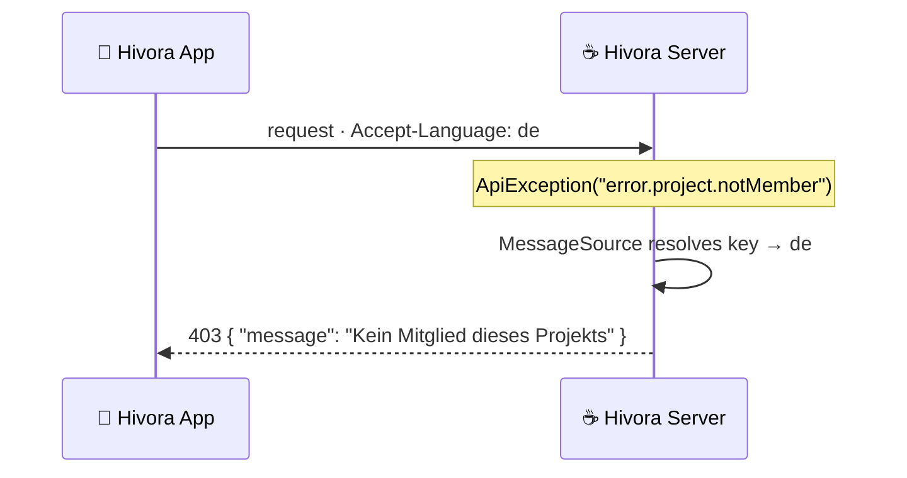

<!-- Logo -->
<p align="center">
  
</p>

<!-- Tagline -->
<p align="center">
  <b>Open-source, self-hosted project-management server — the backend of <a href="https://github.com/Ahmadre/Hivora">Hivora</a>.</b><br>
  <sub>Spring Boot 4 · Java 21 · MongoDB · no user, team or board limits, ever.</sub>
</p>

<!-- Badges -->
<p align="center">
  
  
  
  
  
</p>

<p align="center">
  <a href="#-features">Features</a> ·
  <a href="#-security">Security</a> ·
  <a href="#-quick-start-production">Quick start</a> ·
  <a href="#-local-development">Development</a> ·
  <a href="#-configuration">Configuration</a> ·
  <a href="#-api">API</a> ·
  <a href="#-license">License</a>
</p>

---

## ✨ Features

| Feature | Details |
| --- | --- |
| 📁 **Projects** | per-project workflows, issue numbering (`ASTA-42`) |
| 🐛 **Issues** | types, priorities, tags, subtasks, dependencies, attachments (S3), comments |
| 📋 **Agile boards** | sprints, columns mapped to workflow states, WIP limits |
| ⏱️ **Time tracking** | work items with activity types + weekly timesheets |
| 📈 **Gantt** | read model (start/due dates, dependencies, progress) |
| 📑 **Reports** | state/priority/assignee distributions, created vs. resolved, time per project |
| 📊 **Dashboard** | today's tasks, completion, ranking, tracker |
| 📚 **Knowledge base** | hierarchical Markdown articles, global or per project |
| 🔔 **Notifications** | in-app + e-mail (SMTP), push-ready (FCM) |
| 📨 **E-mail → ticket** | IMAP polling turns inbound mail into issues |
| 🔑 **SSO** | OpenID Connect, OAuth 2.0, SAML 2.0, LDAP — configured at runtime |
| 🧙 **Setup wizard** | first-run flow, or fully automated via `HIVORA_SETUP_*` |

---

## 🛡️ Security

> Hardened by default and mapped to the OWASP Top 10.

- 🔐 Stateless **JWT (HS512)** with short-lived access + refresh tokens; refresh tokens are rejected for API access
- 🔑 **BCrypt** (strength 12) password hashes, minimum 10-character passwords
- 🚧 Database-backed login blocking (survives restarts) + **bucket4j** rate limiting per client IP (strict budget on `/auth/**`)
- 🛂 Strict authorization by default; `/api/v1/admin/**` requires `ADMIN`
- 🧱 Hardened headers (HSTS, CSP, no-referrer), **localized** stable JSON errors without stack traces, regex-escaped search input
- 📎 Content-type &amp; size-validated uploads with randomized S3 object keys, presigned downloads
- 🙈 Secrets are write-only in the admin API (never echoed back)

---

## 🌍 Localized error messages

Error messages are resolved server-side from `messages.properties` (English,
default) and `messages_de.properties`, keyed off the client's `Accept-Language`
header — so a German client receives German errors without any hardcoded strings
in the app.



---

## 🚀 Quick start (production)

```bash
cp .env.example .env
./deploy/generate-secrets.sh   # creates Mongo keyfile + prints secrets for .env
docker compose up -d
```

This starts the server, a MongoDB **replica set (2 data nodes + 1 arbiter)**,
MinIO and Mailpit. Point the Hivora app at `HIVORA_BASE_URL` and complete the
in-app setup wizard (or set `HIVORA_SETUP_AUTO_COMPLETE=true`).

---

## 🛠️ Local development

```bash
docker compose -f docker-compose.dev.yml up -d   # Mongo RS, Mailpit, MinIO
HIVORA_MONGODB_URI="mongodb://localhost:27017/hivora?replicaSet=rs0&directConnection=true" \
HIVORA_S3_ACCESS_KEY=hivora HIVORA_S3_SECRET_KEY=hivora-dev-secret \
./mvnw spring-boot:run
```

- 📬 Mailpit UI: <http://localhost:8025> · 🪣 MinIO console: <http://localhost:9001>
- ✅ Run tests: `./mvnw verify`

---

## ⚙️ Configuration

All settings are environment variables — see [.env.example](.env.example).
Runtime settings (SSO, e-mail ingest, push) live in MongoDB and are managed from
the app's admin area; changes apply **without restart**.

<details>
  <summary><b>📋 Environment variables</b></summary>

<br>

| Variable | Purpose |
| --- | --- |
| `HIVORA_BASE_URL` | Public URL (JWT issuer, SSO redirects) |
| `HIVORA_JWT_SECRET` | HS512 secret, ≥ 64 chars (required in production) |
| `HIVORA_MONGODB_URI` | Mongo connection string |
| `HIVORA_SMTP_*` | Outbound mail (Mailpit in dev) |
| `HIVORA_S3_*` | S3-compatible storage (MinIO in dev) |
| `HIVORA_APP_MIN_VERSION` | Force-update gate for the app |
| `HIVORA_PRIVACY_POLICY_URL` | Privacy policy link served to the app |
| `HIVORA_SETUP_*` | Optional non-interactive first-run setup |
| `HIVORA_RATE_LIMIT_*` | Rate limiting &amp; brute-force thresholds |

</details>

---

## 🌐 API

REST under `/api/v1`. Public endpoints:

```text
/meta · /setup/status · /setup · /auth/login · /auth/refresh
/auth/sso/providers · /actuator/health
```

Everything else requires a bearer token.

---

## 🔁 CI/CD

GitHub Actions ([.github/workflows/ci.yml](.github/workflows/ci.yml)) runs tests
on every push/PR and publishes the Docker image to **GHCR** on `main` and
version tags.

---

## 📄 License

**GPL-3.0** — see [LICENSE](LICENSE).

<p align="center"><sub>Made with 🍯 by Rebar Ahmad</sub></p>
